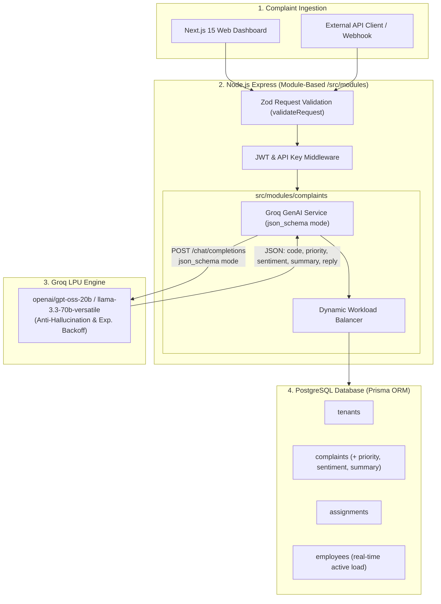
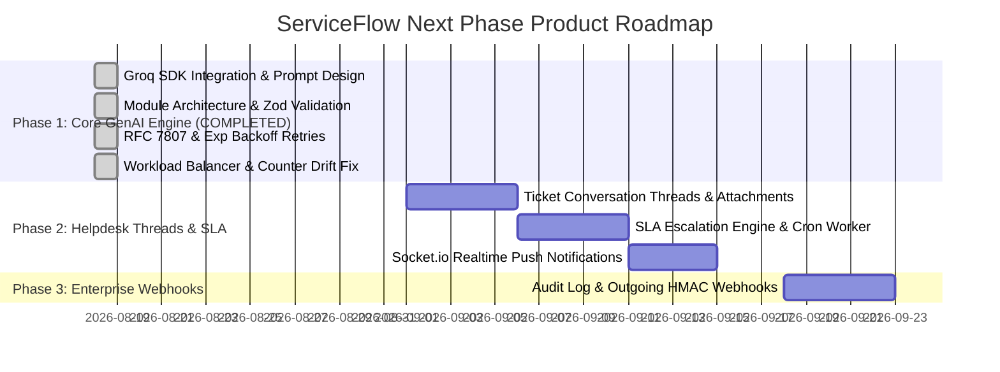

# ServiceFlow — GenAI Product Roadmap & System Architecture (`features.md`)

> **Authoritative Architectural Record & Product Roadmap for ServiceFlow**  
> *Engineered with Groq LPU GenAI Engine (`openai/gpt-oss-20b` / `llama-3.3-70b-versatile`), Node.js Express 5 (Module-Based Architecture), Prisma ORM + PostgreSQL, and Next.js 15.*

---

## 1. Executive Summary & Architecture Shift

ServiceFlow has transformed from a legacy microservice architecture into an **Enterprise GenAI Ticket Intelligence Platform**. By replacing the custom Python TF-IDF classifier with **Groq LPUs**, ServiceFlow delivers sub-200ms zero-shot ticket classification, automated priority triage, sentiment detection, concise ticket summarization, and suggested auto-reply drafting in a **single unified API call**.



---

## 2. Feature Implementation Status Matrix

| Feature | Status | Architecture & Details |
| :--- | :--- | :--- |
| **Groq Multi-Task Ingestion** | ✅ **COMPLETED** | Single-pass zero-shot classification via `groq-sdk` using `json_schema` mode |
| **Anti-Hallucination Pattern** | ✅ **COMPLETED** | Semantic Slug Mapping + Dynamic Zod Enum Validation + In-Memory UUID Resolver Map |
| **Dynamic Workload Balancer** | ✅ **COMPLETED** | Live active ticket count `COUNT(open/in_progress)`, drift fix, unassigned admin fallback |
| **Module-Based Backend** | ✅ **COMPLETED** | 7 Domain modules (`auth`, `complaints`, `departments`, `employees`, `tenants`, `api-keys`, `invites`) with `index.ts` exports |
| **Zod Route Validation** | ✅ **COMPLETED** | `validateRequest` middleware attached across `req.body`, `req.params`, `req.query` |
| **RFC 7807 Error Standard** | ✅ **COMPLETED** | Standardized `application/problem+json` error responses with `invalid_params` |
| **Groq HTTP 429 Resilience** | ✅ **COMPLETED** | 3-attempt exponential backoff retry loop with jitter & model switching fallback |
| **Prisma Schema AI Fields** | ✅ **COMPLETED** | `Priority`, `Sentiment`, `summary`, `suggestedReply`, `aiReasoning`, `aiConfidence` stored in DB |
| **Deprecate Python Service** | ✅ **COMPLETED** | Python `classifier/` removed; 100% serverless LLM classification |
| **Ticket Conversation Threads** | ⏳ *Planned (Phase 2)* | `ticket_messages` table, customer/agent replies, internal notes |
| **SLA Engine & Escalation** | ⏳ *Planned (Phase 2)* | Background cron worker enforcing 2h/6h/24h/48h SLAs |
| **Realtime WebSockets (SSE)** | ⏳ *Planned (Phase 2)* | Socket.io live event push for ticket assignments |
| **Outgoing Webhooks** | ⏳ *Planned (Phase 3)* | HMAC-SHA256 signed webhook delivery on ticket events |

---

## 3. Completed Architecture & Core Components (In-Depth)

### 3.1. Groq GenAI Multi-Task Ingestion Engine & Anti-Hallucination Strategy
- **`json_schema` Mode**: Executes `groq.chat.completions.create` using model `openai/gpt-oss-20b` (fallback `llama-3.3-70b-versatile`).
- **3-Layer Anti-Hallucination Guardrail**:
  1. **Semantic Slugs**: Passes clean string codes (e.g. `billing`, `technical_support`) to the AI rather than random 36-character database UUIDs.
  2. **Dynamic Zod Enum**: Restricts `department_code` property in `json_schema` strictly to valid tenant department codes.
  3. **In-Memory UUID Resolver**: Translates validated AI code back to real PostgreSQL UUID (`deptCodeToUuidMap.get(code)`).

```typescript
// src/modules/complaints/groq.service.ts
const response = await groq.chat.completions.create({
  model: "openai/gpt-oss-20b",
  messages: [
    { role: "system", content: systemPrompt },
    { role: "user", content: complaintText }
  ],
  response_format: {
    type: "json_schema",
    json_schema: {
      name: "complaint_analysis",
      strict: true,
      schema: {
        type: "object",
        properties: {
          department_code: { type: "string", enum: validDepartmentCodes },
          confidence: { type: "number" },
          priority: { type: "string", enum: ["LOW", "MEDIUM", "HIGH", "URGENT"] },
          sentiment: { type: "string", enum: ["HAPPY", "NEUTRAL", "FRUSTRATED", "ANGRY"] },
          summary: { type: "string" },
          suggested_reply: { type: "string" },
          reasoning: { type: "string" }
        },
        required: ["department_code", "confidence", "priority", "sentiment", "summary", "suggested_reply", "reasoning"],
        additionalProperties: false
      }
    }
  }
});
```

---

### 3.2. Dynamic Workload Balancing Algorithm & Counter Drift Fix
- **Live Active Load Calculation**:
  $$\text{Active Load} = \text{COUNT}(\text{assignments WHERE } \text{status} \in [\text{'open'}, \text{'in\_progress'}] \text{ AND } \text{deletedAt IS NULL})$$
- **Automatic Load Sync**: Recalculates `employee.load` whenever tickets change status (`open` $\rightarrow$ `resolved`), are soft-deleted, restored, or reassigned.
- **Graceful Unassigned Fallback**: Auto-assigns to Tenant Admin or places in `UNASSIGNED_QUEUE` with an alert if no active agents exist in the Groq-predicted department.

---

### 3.3. Module-Based Backend Architecture (`src/modules/`)
The backend is structured into 7 domain modules with barrel `index.ts` exports:

```
backend/src/
├── app.ts                     # Express setup & global error middleware
├── routes.ts                  # Master Router importing module index exports
│
├── modules/
│   ├── auth/                  # Register, Login (auth.controller, auth.routes, auth.schema)
│   ├── complaints/            # Ingestion, Groq Service, Workload Service, Schemas, Routes
│   ├── departments/           # Department CRUD, Slugs, Schemas, Routes
│   ├── employees/             # Active/Deleted Employee Management, Assignments, Schemas, Routes
│   ├── tenants/               # Tenant Settings & Routing Mode
│   ├── api-keys/              # Bearer Key Generation & Revocation
│   └── invites/               # Admin Invites & Onboarding
│
├── config/                    # config.ts, db.ts, groq.ts
├── middlewares/               # adminmiddleware, apikeymiddleware, auth, validate.middleware, error.middleware
├── utils/                     # rfc7807.ts, hash.ts
└── types/                     # express.d.ts
```

---

### 3.4. API Request Validation & RFC 7807 Error Formatting
- **Zod Route Protection**: `validateRequest({ body?, query?, params? })` attached across all Express routes.
- **RFC 7807 Problem Details**: Standardized `application/problem+json` error responses formatted with field-level `invalid_params` details.
- **HTTP 429 Exponential Backoff Retries**: 3-attempt retry loop with randomized jitter ($500\text{ms} \rightarrow 1000\text{ms} \rightarrow 2000\text{ms}$) and automatic model switching fallback.

---

## 4. Database Schema (Prisma PostgreSQL)

```prisma
enum Priority {
  LOW
  MEDIUM
  HIGH
  URGENT
}

enum Sentiment {
  HAPPY
  NEUTRAL
  FRUSTRATED
  ANGRY
}

model Complaint {
  id                    String          @id @default(uuid()) @db.Uuid
  tenantId              String          @map("tenant_id") @db.Uuid
  title                 String
  description           String?
  customerName          String?         @map("customer_name")
  customerEmail         String?         @map("customer_email")
  externalReferenceId   String?         @map("external_reference_id")
  status                ComplaintStatus @default(open)
  priority              Priority        @default(MEDIUM)
  sentiment             Sentiment       @default(NEUTRAL)
  summary               String?         @db.Text
  suggestedReply        String?         @map("suggested_reply") @db.Text
  aiReasoning           String?         @map("ai_reasoning") @db.Text
  aiConfidence          Float?          @map("ai_confidence")
  isCorrectlyClassified Boolean         @default(false) @map("is_correctly_classified")
  createdAt             DateTime        @default(now()) @map("created_at") @db.Timestamp(6)
  updatedAt             DateTime        @default(now()) @updatedAt @map("updated_at") @db.Timestamp(6)
  deletedAt             DateTime?       @map("deleted_at") @db.Timestamp(6)

  tenant      Tenant       @relation(fields: [tenantId], references: [id], onDelete: Cascade)
  assignments Assignment[]

  @@index([tenantId], map: "idx_complaints_tenant_id")
  @@index([status], map: "idx_complaints_status")
  @@index([deletedAt], map: "idx_complaints_deleted_at")
  @@map("complaints")
}
```

---

## 5. Upcoming Roadmap & Next Steps



---

## 6. Summary Verdict

ServiceFlow's backend is now fully modernized with a **sub-200ms Groq GenAI pipeline**, **Anti-Hallucination guardrails**, **Dynamic Workload Balancing**, **Module-Based Architecture**, **Zod route validation**, and **RFC 7807 enterprise error handling**.
