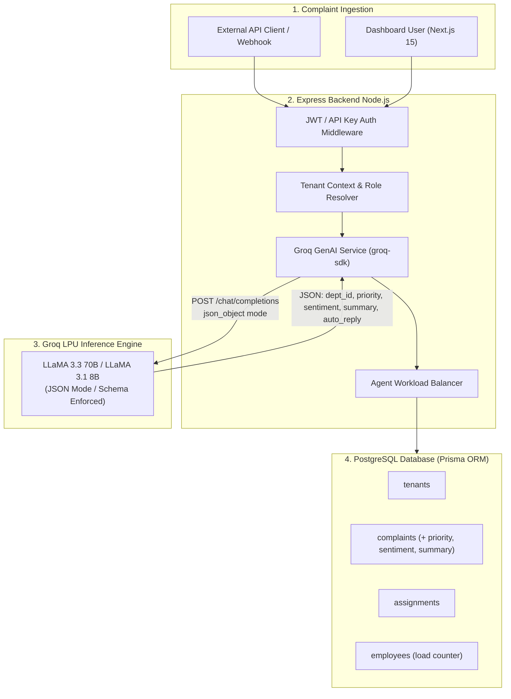
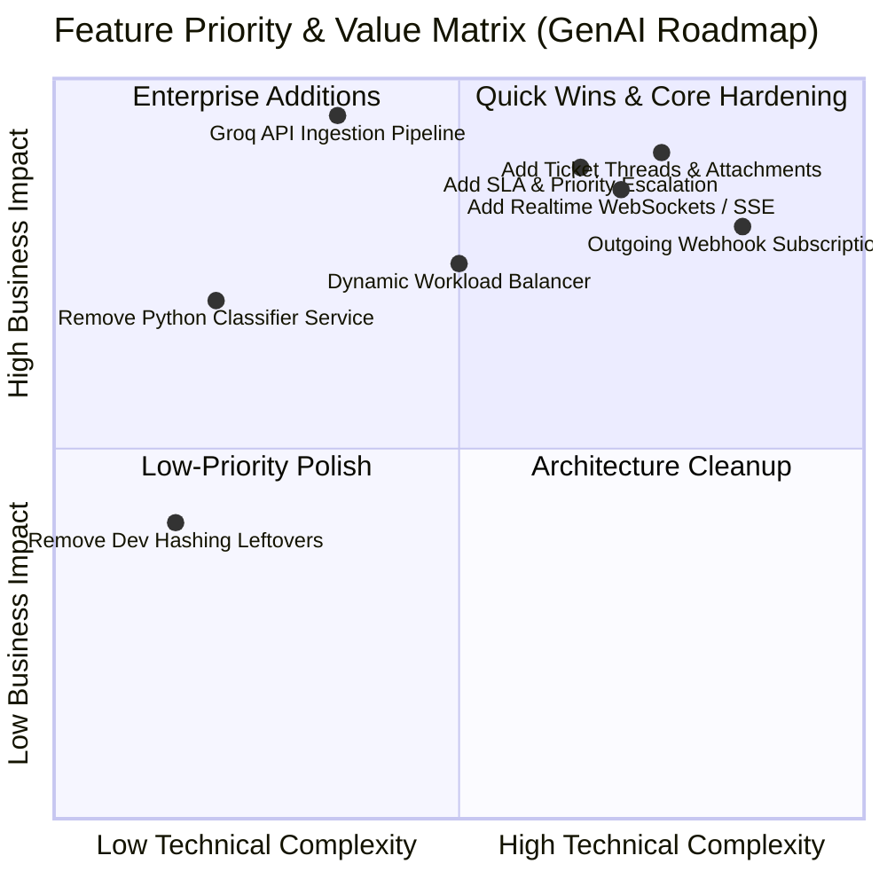
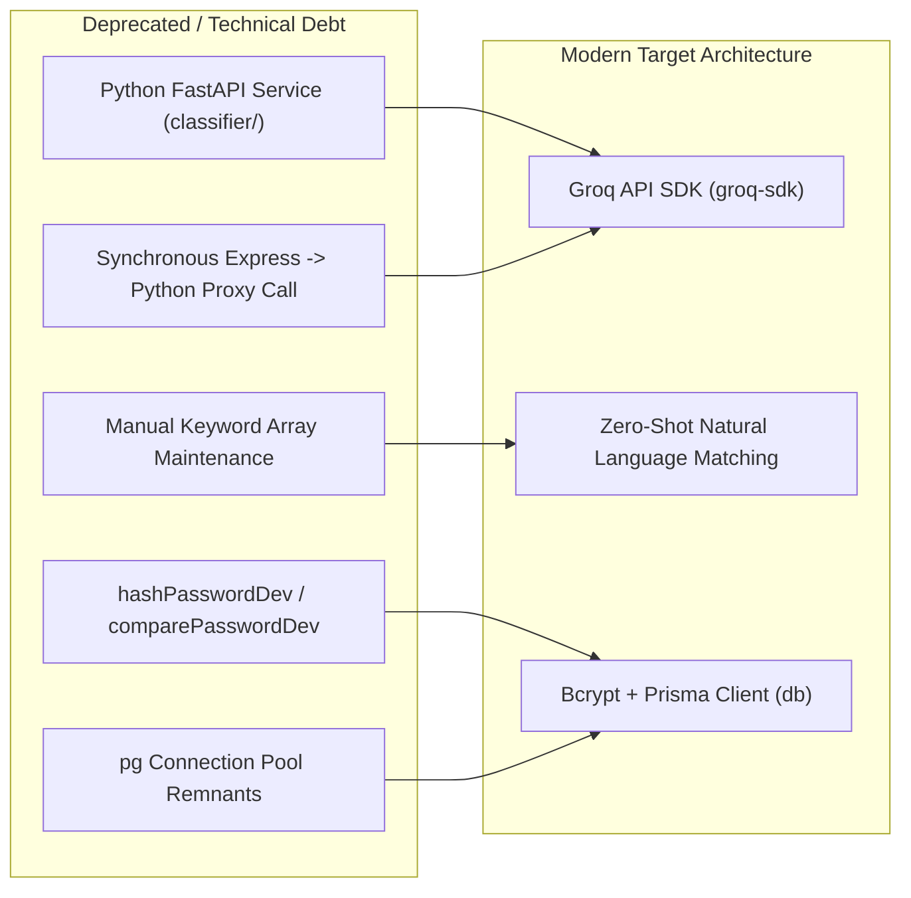
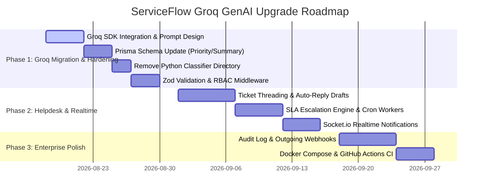

# ServiceFlow — GenAI & Groq API Product Roadmap (`features.md`)

> **Authoritative Architectural Assessment & Actionable Product Roadmap for ServiceFlow**
> *Re-architected for Groq LPU GenAI Engine (LLaMA 3.3 70B / LLaMA 3.1 8B), Node.js Express, Prisma ORM, and Next.js 15.*

---

## 1. Executive Summary & Architecture Shift

ServiceFlow is evolving from a traditional keyword-matching vectorizer into a **Next-Generation GenAI Ticket Intelligence Platform**. By replacing the custom Python TF-IDF classifier microservice with the **Groq API** (`llama-3.3-70b-versatile` / `llama-3.1-8b-instant`), ServiceFlow achieves sub-200ms zero-shot ticket classification, automated priority triage, sentiment detection, ticket summarization, and suggested response drafting in a **single unified API call**.



---

## 2. Priority Feature Matrix



| Category | High Priority | Medium Priority | Low Priority |
| :--- | :--- | :--- | :--- |
| **Features to IMPROVE** | Groq API Multi-Task Ingestion, Dynamic Workload Balancer with Decrement Logic, Express Strict RBAC (`requireRole`) | Zod Request Validation & RFC 7807 Error Formatting, Database Soft Delete Integrity | TanStack Query Data Fetching with Optimistic UI, Unified Design Tokens |
| **Features to REMOVE** | Legacy Python FastAPI Microservice (`classifier/`), Manual Keyword Maintenance, Synchronous Classifier HTTP Proxy Calls | Legacy Dev Hashing Code, Raw `pg` Connection Boilerplate | Hardcoded Hex Design Colors |
| **Features to ADD** | Groq-Powered Ticket Priority (`URGENT`/`HIGH`/`LOW`), Sentiment & Summary Extraction, AI Draft Auto-Reply | Ticket Conversation Threads & S3 Attachments, SLA Engine & Auto-Escalation | Real-Time SSE/WebSockets, Audit Log & History Trail, Outgoing Webhook Subscriptions |

---

## 3. Features to IMPROVE (In-Depth)

### 3.1. Groq-Powered Multi-Task Ticket Routing Pipeline
> [!IMPORTANT]
> **Enhancement**: Replace keyword TF-IDF matrices with a single Groq API call (`llama-3.3-70b-versatile`) operating in JSON enforcement mode (`response_format: { type: "json_object" }`).

- **Multi-Task Extraction**: A single Groq call handles:
  1. **Target Department/Employee Selection** (matching against department descriptions rather than rigid keyword lists).
  2. **Confidence Score & Reasoning**.
  3. **Priority Assessment**: `LOW`, `MEDIUM`, `HIGH`, `URGENT`.
  4. **Customer Sentiment Analysis**: `HAPPY`, `NEUTRAL`, `FRUSTRATED`, `ANGRY`.
  5. **Concise AI Summary**: 1-sentence synopsis of the customer issue.
  6. **Suggested AI Auto-Reply Draft**: Instant response ready for agent approval.

### 3.2. Dynamic Workload Balancing Algorithm
> [!NOTE]
> **Enhancement**: Fix load counter drift by automatically decrementing `employees.load` when tickets are marked `resolved` or soft-deleted.
- Compute real-time load via active ticket count: `COUNT(assignments WHERE status IN ('open', 'in_progress'))`.
- Gracefully handle unassigned department states: if no active employees exist in a Groq-predicted department, auto-assign to the tenant admin or place in an `UNASSIGNED_QUEUE` with an alert.

### 3.3. Authentication, RBAC & Security Hardening
- Implement dedicated Express role authorization middleware: `requireRole('ADMIN')` and `requireRole('AGENT')`.
- Upgrade JWT sessions to support short-lived Access Tokens (15 min) paired with HttpOnly Refresh Tokens (7 days) with revocation capability.
- Protect Groq API keys using secure server-side environment variable loading (`GROQ_API_KEY`) with fallback rate limiting.

### 3.4. API Request Validation & Error Handling
- Introduce **Zod** schema validation across all Express routes (`req.body`, `req.params`, `req.query`).
- Format all API errors following **RFC 7807 (Problem Details for HTTP APIs)**.
- Implement exponential backoff retries and fallback classifiers in case of Groq API rate limits (HTTP 429).

### 3.5. Frontend UI & Dashboard Enhancement
- Display Groq AI metadata on ticket cards:
  - **Priority Badges**: Red `URGENT`, Orange `HIGH`, Blue `MEDIUM`, Gray `LOW`.
  - **Sentiment Indicator**: Emoji/badge showing customer frustration level.
  - **AI Ticket Summary**: Displayed in ticket expansion panels.
  - **AI Auto-Reply Box**: Pre-filled response ready for 1-click agent sending.
- Migrate raw `useEffect` fetches to **TanStack Query** with optimistic UI updates.

---

## 4. Features to REMOVE (Deprecations & Architecture Cleanup)



### 4.1. Entire Python FastAPI Microservice (`classifier/`)
- **Reason for Removal**: The Python microservice requires separate deployment, virtual environments, scikit-learn dependencies, joblib model persistence, and keyword retraining. Groq API eliminates the need for a separate ML backend entirely.
- **Action**: Deprecate and remove the `classifier/` directory.

### 4.2. Manual Keyword Array Maintenance
- **Reason for Removal**: Department and employee creation currently forces admins to manually input keyword lists (e.g. `"payment refund billing invoice"`).
- **Action**: Replace keyword arrays with natural language **department descriptions** (e.g., *"Handles all customer billing inquiries, payment failures, duplicate charges, and refund requests"*), which Groq evaluates zero-shot.

### 4.3. Legacy Dev Hashing Code
- **Reason for Removal**: Residual functions `hashPasswordDev` and `comparePasswordDev` in `backend/src/utils/hash.ts` pose security risks.
- **Action**: Completely remove dev hashing functions and standardise on `bcrypt` (10 rounds).

### 4.4. Raw `pg` Connection Boilerplate
- **Reason for Removal**: Post-Prisma migration, leftover `pg` Pool imports or manual `client.connect()` / `client.release()` calls are redundant.
- **Action**: Eliminate all remaining `pg` pool imports.

---

## 5. Features to ADD (New GenAI Capabilities)

### 5.1. Groq GenAI Multi-Task Ingestion Engine
> [!TIP]
> **Implementation**: Add `backend/src/services/groq.service.ts` using `groq-sdk`.

```typescript
import Groq from "groq-sdk";
const groq = new Groq({ apiKey: process.env.GROQ_API_KEY });

export interface GroqRoutingResult {
  department_id: string;
  confidence: number;
  priority: "LOW" | "MEDIUM" | "HIGH" | "URGENT";
  sentiment: "HAPPY" | "NEUTRAL" | "FRUSTRATED" | "ANGRY";
  summary: string;
  suggested_reply: string;
  reasoning: string;
}

export async function classifyComplaintWithGroq(
  complaintText: string,
  departments: { id: string; name: string; description: string }[]
): Promise<GroqRoutingResult> {
  const completion = await groq.chat.completions.create({
    messages: [
      {
        role: "system",
        content: `You are an elite customer service routing AI. Analyze the complaint and route it to the single best department.
Available Departments: ${JSON.stringify(departments)}

Return ONLY a JSON object matching this schema:
{
  "department_id": "string",
  "confidence": number between 0 and 1,
  "priority": "LOW" | "MEDIUM" | "HIGH" | "URGENT",
  "sentiment": "HAPPY" | "NEUTRAL" | "FRUSTRATED" | "ANGRY",
  "summary": "1 sentence complaint summary",
  "suggested_reply": "polite professional initial response draft",
  "reasoning": "brief explanation"
}`
      },
      { role: "user", content: complaintText }
    ],
    model: "llama-3.3-70b-versatile",
    response_format: { type: "json_object" },
    temperature: 0.2
  });

  return JSON.parse(completion.choices[0].message.content!);
}
```

### 5.2. Ticket Conversation Threads & Attachments
- Create `ticket_messages` table for customer replies, agent messages, and internal notes (`is_internal: boolean`).
- Add AWS S3 / Cloudflare R2 presigned file upload endpoints for screenshots, PDFs, and log attachments.

### 5.3. SLA Tracking & Automated Priority Escalation
- Add fields to `Complaint`: `priority`, `sentiment`, `summary`, `suggestedReply`, `slaDueAt`.
- Background worker checks tickets every 5 minutes:
  - `URGENT` tickets: SLA 2 hours.
  - `HIGH` tickets: SLA 6 hours.
  - `MEDIUM` tickets: SLA 24 hours.
  - `LOW` tickets: SLA 48 hours.
- Auto-escalate tickets breaching SLA deadlines to Senior Agents / Admins.

### 5.4. Real-Time WebSockets / SSE Notifications
- Add **Socket.io** or **Server-Sent Events (SSE)** to push real-time events (`ticket:assigned`, `ticket:status_changed`, `ticket:message_received`) directly to agent screens.

### 5.5. Audit Log & History Trail
- Create `assignment_history` table recording assignee changes, timestamps, and reassignment reasons.
- Create `audit_logs` table tracking admin security actions.

### 5.6. Outgoing Webhooks Framework
- Allow admins to register outgoing webhook URLs per tenant signed with secret HMAC-SHA256 signatures.
- Trigger webhooks on `complaint.created`, `complaint.resolved`, and `sla.breached`.

---

## 6. Schema Extensions (Prisma)

```prisma
enum Priority {
  LOW
  MEDIUM
  HIGH
  URGENT
}

enum Sentiment {
  HAPPY
  NEUTRAL
  FRUSTRATED
  ANGRY
}

model Complaint {
  id                    String          @id @default(dbgenerated("uuid_generate_v4()")) @db.Uuid
  tenantId              String          @map("tenant_id") @db.Uuid
  title                 String
  description           String?
  customerName          String?         @map("customer_name")
  customerEmail         String?         @map("customer_email")
  externalReferenceId   String?         @map("external_reference_id")
  status                ComplaintStatus @default(open)
  priority              Priority        @default(MEDIUM)
  sentiment             Sentiment       @default(NEUTRAL)
  summary               String?         @db.Text
  suggestedReply        String?         @map("suggested_reply") @db.Text
  slaDueAt              DateTime?       @map("sla_due_at") @db.Timestamp(6)
  isCorrectlyClassified Boolean         @default(false) @map("is_correctly_classified")
  createdAt             DateTime        @default(now()) @map("created_at") @db.Timestamp(6)
  updatedAt             DateTime        @default(now()) @updatedAt @map("updated_at") @db.Timestamp(6)
  deletedAt             DateTime?       @map("deleted_at") @db.Timestamp(6)

  tenant      Tenant          @relation(fields: [tenantId], references: [id], onDelete: Cascade)
  assignments Assignment[]
  messages    TicketMessage[]

  @@index([tenantId], map: "idx_complaints_tenant_id")
  @@index([status], map: "idx_complaints_status")
  @@index([priority], map: "idx_complaints_priority")
  @@map("complaints")
}

model TicketMessage {
  id          String    @id @default(dbgenerated("uuid_generate_v4()")) @db.Uuid
  complaintId String    @map("complaint_id") @db.Uuid
  senderId    String?   @map("sender_id") @db.Uuid
  senderType  String    @map("sender_type") // CUSTOMER | AGENT | SYSTEM
  isInternal  Boolean   @default(false) @map("is_internal")
  body        String    @db.Text
  createdAt   DateTime  @default(now()) @map("created_at") @db.Timestamp(6)

  complaint Complaint @relation(fields: [complaintId], references: [id], onDelete: Cascade)

  @@index([complaintId], map: "idx_messages_complaint_id")
  @@map("ticket_messages")
}
```

---

## 7. Implementation Roadmap & Milestones



---

## 8. Conclusion

Adopting **Groq API** elevates ServiceFlow into a high-performance **GenAI Service Desk**. By deprecating the legacy Python classifier microservice and utilizing LLaMA 3.3 70B on Groq LPUs, ServiceFlow gains zero-shot ticket classification, automated priority triage, sentiment detection, instant summaries, and auto-reply drafts—all delivered at sub-200ms speeds with zero custom ML model training overhead.
