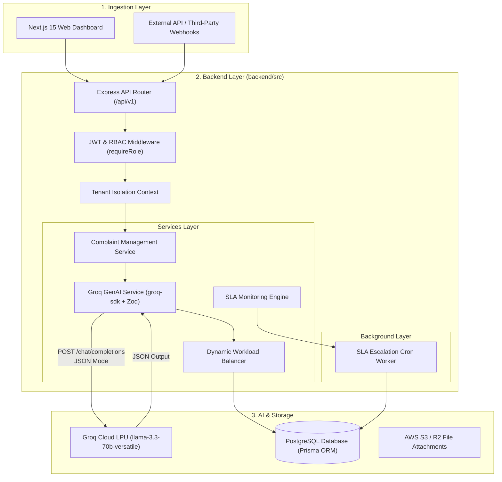

# ServiceFlow Architecture & Implementation Plan (`firststep.md`)

> **Architectural Assessment & Project Structure Guide**  
> *Target Stack: Node.js (Express 5 + TypeScript), Groq SDK (`llama-3.3-70b-versatile`), Prisma ORM + PostgreSQL, Next.js 15.*

---

## 1. Technology Choice: Should You Use `langchain-js`?

### ❌ Recommendation: DO NOT USE `langchain-js`

For ServiceFlow's specific requirements as defined in `features.md`, **LangChain.js is an anti-pattern and unnecessary overhead**.

### 🔍 Detailed Tech Evaluation Matrix

| Criterion | Direct `groq-sdk` (RECOMMENDED) | Vercel AI SDK (`@ai-sdk/groq`) | LangChain.js (`langchain`) |
| :--- | :--- | :--- | :--- |
| **Primary Use Case Fit** | **10/10** (Built for ultra-fast single-pass JSON extraction) | **9/10** (Great schema validation wrapper) | **4/10** (Over-engineered for simple extraction) |
| **Inference Latency** | **Sub-200ms** (Zero wrapper latency) | **Sub-200ms** (Minimal overhead) | **+100-300ms** (Nested wrapper & chain execution cost) |
| **Dependency Footprint** | **~2 MB** (Single lightweight SDK) | **~5 MB** (Clean modular packages) | **>50 MB** (Massive dependency tree) |
| **JSON Mode & Schemas** | Native Groq `json_object` + Zod parsing | Native `generateObject` with Zod | Complex `StructuredOutputParser` / OutputFixingParser |
| **Debugging & DX** | Direct stack traces, plain async/await | Clean functional APIs | Deeply nested Runnable call stacks, abstract abstractions |
| **Vendor Lock-in** | Minimal (Standard REST wrapper) | Very Low (Provider-agnostic) | High (LangChain abstractions) |

---

### Why `langchain-js` is Wrong for ServiceFlow

1. **Unnecessary Abstraction for Single-Pass Multi-Task Routing**:  
   ServiceFlow requires a **single, zero-shot structured LLM call** to perform department routing, priority triage, sentiment detection, summary extraction, and auto-reply drafting in one prompt. LangChain is built for multi-step agentic loops, vector store RAG pipelines, and complex prompt chaining—none of which are needed here.

2. **Latency Impact on Sub-200ms Goals**:  
   Groq LPUs deliver blazing fast inference (~500+ tokens/sec). LangChain's internal pipeline execution (`RunnableSequence`, prompt formatters, output parser layers) adds unnecessary JS runtime overhead, running counter to ServiceFlow's sub-200ms SLA target.

3. **Brittle Error Handling & Rate Limits**:  
   Handling HTTP 429 (rate limits) or fallback classifiers directly with `groq-sdk` or standard exponential backoff retries is clean and transparent. LangChain hides raw HTTP responses behind abstraction layers, complicating custom retry/fallback logic.

4. **Maintenance & Complexity**:  
   LangChain JS experiences frequent API surface updates and deprecation cycles. Direct SDK integration (`groq-sdk`) coupled with **Zod** provides maximum stability, explicit type safety, and total control.

---

### 💡 Recommended GenAI Stack Options

- **Option A (Best Fit / Primary)**: Direct **`groq-sdk`** + **`zod`**  
  *Zero dependency bloat, maximum execution speed, native Groq JSON mode (`response_format: { type: "json_object" }`), explicit Zod parsing.*
- **Option B (Alternative)**: **Vercel AI SDK** (`ai` + `@ai-sdk/groq`)  
  *If you want standard `generateObject()` with Zod schema validation out-of-the-box while retaining lightweight execution.*

---

## 2. Target System Architecture



---

## 3. Comprehensive Project Directory Structure (Module-Based Architecture)

> **Architectural Recommendation**: Use a **Module-Based (Domain/Feature) Structure** under `backend/src/modules/`. Co-locating controllers, services, schemas, and routes per feature improves developer velocity, domain encapsulation, and long-term scalability.

```
ServiceFlow/
├── features.md                    # Product Roadmap & Requirements
├── firststep.md                   # Architecture & Implementation Plan
├── README.md                      # Project Overview
├── docker-compose.yml             # Local Postgres & Redis Services
│
├── backend/                       # Node.js + Express + TypeScript Backend
│   ├── package.json
│   ├── tsconfig.json
│   ├── nodemon.json
│   ├── .env.example
│   │
│   ├── prisma/
│   │   ├── schema.prisma          # PostgreSQL Schema (Enums, Tenant, Complaint, Messages, SLA)
│   │   ├── migrations/            # Migration History
│   │   └── seed.ts                # Database Seeder (Tenants, Departments, Admins)
│   │
│   └── src/
│       ├── server.ts              # HTTP & WebSocket Server Entry Point
│       ├── app.ts                 # Express Application Configuration & Global Middlewares
│       ├── routes.ts              # Master API Router Mounting Module Routes (/api/v1)
│       │
│       ├── modules/               # Feature / Domain Modules (HIGH COHESION)
│       │   ├── auth/              # Authentication & Session Module
│       │   │   ├── auth.controller.ts
│       │   │   ├── auth.service.ts
│       │   │   ├── auth.schema.ts
│       │   │   └── auth.routes.ts
│       │   │
│       │   ├── complaints/        # Ingestion, GenAI Classification & Ticket Lifecycle
│       │   │   ├── complaint.controller.ts
│       │   │   ├── complaint.service.ts
│       │   │   ├── groq.service.ts      # GenAI Zero-Shot Multi-Task Routing Pipeline
│       │   │   ├── workload.service.ts  # Dynamic Workload Balancer
│       │   │   ├── complaint.schema.ts   # Zod Ingestion & Groq Schemas
│       │   │   └── complaint.routes.ts
│       │   │
│       │   ├── ticket-messages/   # Conversation Threads & Attachments
│       │   │   ├── message.controller.ts
│       │   │   ├── message.service.ts
│       │   │   ├── message.schema.ts
│       │   │   └── message.routes.ts
│       │   │
│       │   ├── departments/       # Department Management (Descriptions & Slugs)
│       │   │   ├── department.controller.ts
│       │   │   ├── department.service.ts
│       │   │   ├── department.schema.ts
│       │   │   └── department.routes.ts
│       │   │
│       │   ├── employees/         # Agent Workload & Load Counter
│       │   │   ├── employee.controller.ts
│       │   │   ├── employee.service.ts
│       │   │   ├── employee.schema.ts
│       │   │   └── employee.routes.ts
│       │   │
│       │   ├── sla/               # SLA Monitoring & Auto-Escalation Worker
│       │   │   ├── sla.service.ts
│       │   │   └── sla.worker.ts        # Node-Cron 5-Min Worker
│       │   │
│       │   └── webhooks/          # Outgoing Tenant Webhook Subscriptions
│       │       ├── webhook.service.ts
│       │       └── webhook.routes.ts
│       │
│       └── shared/                # Cross-Cutting Core Concerns
│           ├── config/            # Initializations (env.ts, db.ts, groq.ts, socket.ts)
│           ├── middlewares/       # Core Middlewares (auth, requireRole, tenantContext, validate, error)
│           ├── utils/             # Helpers (hash.ts, jwt.ts, rfc7807.ts, logger.ts)
│           └── types/             # Shared Types & Express Declaration Merging
│
├── frontend/                      # Next.js 15 Web Dashboard
│   ├── package.json
│   ├── next.config.ts
│   ├── src/
│   │   ├── app/                   # App Router Pages & API Routes
│   │   ├── components/            # UI Components & Ticket Cards
│   │   ├── hooks/                 # TanStack Query & Socket Hooks
│   │   ├── lib/                   # API Client & Utilities
│   │   └── types/                 # Frontend Data Types
│
└── classifier/                    # [DEPRECATED / TO BE REMOVED] Python Microservice
```

---

## 4. Anti-Hallucination Architecture & Groq Blueprint (`groq.service.ts`)

> [!WARNING]
> **Why Passing DB UUIDs to AI Breaks Backend Integrity**:
> Passing raw database UUIDs (e.g. `c4b72648-912a-436d-96e0-47fa3a19b889`) to an LLM creates severe risks:
> 1. **UUID Hallucination**: AI can easily hallucinate a single hex character (e.g. `912b` instead of `912a`), producing a valid-looking UUID that does NOT exist in PostgreSQL, causing a Foreign Key crash or invalid DB state.
> 2. **Token Wasting**: 36-character random UUID strings carry zero semantic meaning for LLMs and waste prompt tokens.

### 🛡️ The 3-Layer Anti-Hallucination Strategy

To guarantee **100% backend & database safety**:

1. **Human-Readable Slugs / Codes**: Provide AI with clean, semantic slugs (e.g., `BILLING`, `TECH_SUPPORT`, `ACCOUNT_SECURITY`) or simple indexes (`DEPT_1`, `DEPT_2`) rather than raw database primary key UUIDs.
2. **Dynamic Zod Enum Validation**: Dynamically construct a `z.enum([...validDepartmentCodes])` schema at runtime. If the AI returns any code outside `validDepartmentCodes`, Zod immediately rejects it **before any DB query is attempted**.
3. **In-Memory UUID Resolver Map**: Maintain a `Map<string, string>` (`code -> database_uuid`) in Node.js. Map the validated AI output code back to the real database UUID safely. If an unmapped code ever passes, fall back to a default `UNASSIGNED_QUEUE` or Tenant Admin ID.

```
Incoming Request ──► Build Dept Map (code -> UUID) ──► Groq API (Prompt with codes) 
                                                              │
Postgres DB ◄── Resolve UUID (Map.get(code)) ◄── Zod Enum Check (validates code)
```

---

### Zod Schema Definition (`src/schemas/groq-routing.schema.ts`)

```typescript
import { z } from "zod";

/**
 * Creates a dynamic Zod schema strictly validating AI response against active tenant department codes
 */
export function createGroqRoutingSchema(validDepartmentCodes: string[]) {
  if (validDepartmentCodes.length === 0) {
    throw new Error("Cannot instantiate routing schema with zero departments");
  }

  // Tuple cast required for Zod enum
  const codeTuple = validDepartmentCodes as [string, ...string[]];

  return z.object({
    department_code: z.enum(codeTuple, {
      errorMap: () => ({ message: "AI returned invalid or hallucinated department code" })
    }),
    confidence: z.number().min(0).max(1),
    priority: z.enum(["LOW", "MEDIUM", "HIGH", "URGENT"]),
    sentiment: z.enum(["HAPPY", "NEUTRAL", "FRUSTRATED", "ANGRY"]),
    summary: z.string().max(300),
    suggested_reply: z.string().max(1000),
    reasoning: z.string().max(500)
  });
}

export type GroqRawAiOutput = {
  department_code: string;
  confidence: number;
  priority: "LOW" | "MEDIUM" | "HIGH" | "URGENT";
  sentiment: "HAPPY" | "NEUTRAL" | "FRUSTRATED" | "ANGRY";
  summary: string;
  suggested_reply: string;
  reasoning: string;
};

export type GroqFinalRoutingResult = Omit<GroqRawAiOutput, "department_code"> & {
  department_id: string; // Guaranteed real DB UUID
};
```

---

### Service Implementation (`src/services/groq.service.ts`)

```typescript
import { groqClient } from "../config/groq";
import { createGroqRoutingSchema, GroqFinalRoutingResult } from "../schemas/groq-routing.schema";

export interface DepartmentContext {
  id: string;          // Database UUID
  code: string;        // Human readable slug: e.g. "BILLING", "TECH_SUPPORT"
  name: string;        // Display Name: e.g. "Billing & Refunds"
  description: string; // Detailed description for zero-shot LLM matching
}

export class GroqService {
  /**
   * Performs sub-200ms multi-task extraction with anti-hallucination protection
   */
  static async classifyAndExtractTicket(
    title: string,
    description: string,
    availableDepartments: DepartmentContext[]
  ): Promise<GroqFinalRoutingResult> {
    if (!availableDepartments || availableDepartments.length === 0) {
      throw new Error("No departments provided for routing");
    }

    // 1. Build In-Memory Resolver Map (code -> DB UUID)
    const deptCodeToUuidMap = new Map<string, string>();
    const promptDeptList = availableDepartments.map((dept) => {
      deptCodeToUuidMap.set(dept.code, dept.id);
      return {
        code: dept.code,
        name: dept.name,
        description: dept.description
      };
    });

    const validCodes = Array.from(deptCodeToUuidMap.keys());
    const fullText = `Ticket Title: ${title}\nTicket Description: ${description}`;

    // 2. Construct Anti-Hallucination Prompt using codes
    const systemPrompt = `You are an elite automated helpdesk triage AI for an enterprise Service Desk.
Analyze the incoming customer ticket and classify it accurately based on the available department codes below.

Available Departments:
${JSON.stringify(promptDeptList, null, 2)}

You MUST respond strictly with a single JSON object matching this exact schema:
{
  "department_code": "MUST be exact string code matching one of the available department codes above",
  "confidence": number between 0.0 and 1.0,
  "priority": "LOW" | "MEDIUM" | "HIGH" | "URGENT",
  "sentiment": "HAPPY" | "NEUTRAL" | "FRUSTRATED" | "ANGRY",
  "summary": "1 concise sentence summarizing the customer's issue",
  "suggested_reply": "Polite, empathetic, action-oriented initial reply draft for the customer",
  "reasoning": "1 sentence explanation of why this department code and priority were selected"
}`;

    try {
      const completion = await groqClient.chat.completions.create({
        messages: [
          { role: "system", content: systemPrompt },
          { role: "user", content: fullText }
        ],
        model: "llama-3.3-70b-versatile",
        response_format: { type: "json_object" },
        temperature: 0.1,
        max_tokens: 600
      });

      const rawContent = completion.choices[0]?.message?.content;
      if (!rawContent) {
        throw new Error("Empty response received from Groq API");
      }

      // 3. Dynamic Zod Validation against allowed codes
      const schema = createGroqRoutingSchema(validCodes);
      const parsedJson = JSON.parse(rawContent);
      const validatedAiOutput = schema.parse(parsedJson);

      // 4. Safe In-Memory Lookup: Map code to real PostgreSQL UUID
      const realDepartmentId = deptCodeToUuidMap.get(validatedAiOutput.department_code);
      
      if (!realDepartmentId) {
        throw new Error(`Unmapped department code returned: ${validatedAiOutput.department_code}`);
      }

      return {
        department_id: realDepartmentId, // Guaranteed real DB UUID
        confidence: validatedAiOutput.confidence,
        priority: validatedAiOutput.priority,
        sentiment: validatedAiOutput.sentiment,
        summary: validatedAiOutput.summary,
        suggested_reply: validatedAiOutput.suggested_reply,
        reasoning: validatedAiOutput.reasoning
      };
    } catch (error) {
      console.error("[GroqService Error] Classification failed or code hallucinated:", error);
      
      // Fallback Strategy: Safe assignment to default department
      return this.getFallbackClassification(availableDepartments);
    }
  }

  /**
   * Safe Fallback Classifier (Guarantees valid DB UUID always)
   */
  private static getFallbackClassification(
    departments: DepartmentContext[]
  ): GroqFinalRoutingResult {
    const fallbackDeptId = departments[0]?.id || "00000000-0000-0000-0000-000000000000";
    return {
      department_id: fallbackDeptId,
      confidence: 0.1,
      priority: "MEDIUM",
      sentiment: "NEUTRAL",
      summary: "Manual review required (AI triage fallback engaged)",
      suggested_reply: "Thank you for reaching out. A customer support agent will review your request shortly.",
      reasoning: "Fallback routing assigned due to AI service disruption or invalid code match."
    };
  }
}
```

---

## 5. RFC 7807 Standardized Error Handling

To maintain enterprise API standards, all API errors (validation failures, auth errors, rate limits) should be formatted using **RFC 7807 (Problem Details for HTTP APIs)**:

```typescript
// src/utils/rfc7807.ts
import { Response } from "express";

export interface ApiProblemDetails {
  type: string;
  title: string;
  status: number;
  detail: string;
  instance?: string;
  errors?: Record<string, any>;
}

export function sendProblemDetails(res: Response, problem: ApiProblemDetails) {
  res.setHeader("Content-Type", "application/problem+json");
  return res.status(problem.status).json(problem);
}
```

---

## 6. Actionable Implementation Execution Roadmap

### Phase 1: Backend Cleanup & GenAI Core (Immediate)
1. **Remove Python Microservice**: Delete the `/classifier` folder.
2. **Install Core Backend Dependencies**:
   ```bash
   cd backend
   npm install groq-sdk zod bcrypt socket.io node-cron
   npm install --save-dev @types/bcrypt @types/node-cron
   ```
3. **Database Migration**:
   - Update `prisma/schema.prisma` with `Priority`, `Sentiment`, `Complaint` fields, and `TicketMessage` model.
   - Run `npx prisma migrate dev --name add_groq_genai_fields`.
4. **Implement Groq Service**: Create `src/services/groq.service.ts` and `src/schemas/groq-routing.schema.ts`.

### Phase 2: Express Restructuring & RBAC Hardening
1. **Security & Auth**: Remove `hashPasswordDev`, enforce `bcrypt` (10 rounds), build `requireRole('ADMIN' | 'AGENT')` middleware.
2. **Zod Validation Middleware**: Attach Zod validation to ingestion routes.
3. **Dynamic Workload Balancer**: Update agent load assignment & load decrement logic on resolution.

### Phase 3: Helpdesk Threads & SLA Engine
1. **Ticket Threads**: Create message routes (`/api/v1/complaints/:id/messages`).
2. **SLA Cron Worker**: Implement `src/workers/sla-escalation.worker.ts` with `node-cron` running every 5 minutes.
3. **Real-time WebSockets**: Wire Socket.io into Express for instant agent notifications.

---

## 7. Summary Verdict

- **Use `groq-sdk`**: Lightweight, fast, sub-200ms, and perfectly tailored for single-pass multi-task ticket extraction.
- **Do NOT use `langchain-js`**: Avoid unnecessary abstractions, latency penalties, and dependency bloat.
- **Clean Layered Backend**: Structure `backend/src/` into distinct `controllers`, `services`, `middlewares`, `schemas` (Zod), and `workers`.
