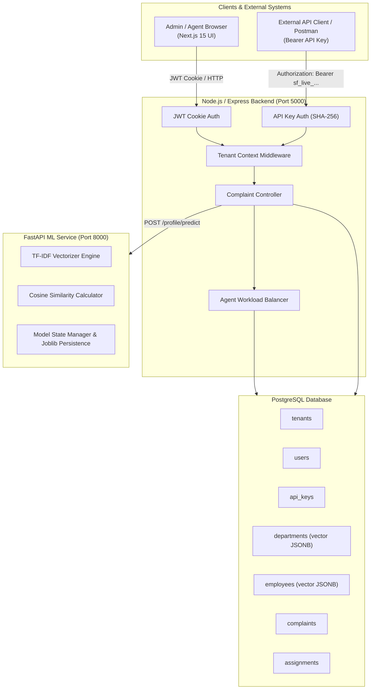
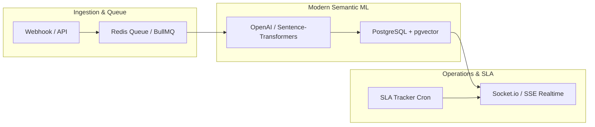

# ServiceFlow — Complete Project Evaluation & Architectural Report

> **Comprehensive Analysis, Feature Audit, Security Assessment, and Resume Optimization Strategy for ServiceFlow**

---

## 1. Executive Summary & System Overview

**ServiceFlow** is a modern, **multi-tenant AI/ML-driven complaint routing and service management platform**. It is designed to automatically ingest customer complaints via authenticated API endpoints, vectorize ticket descriptions, classify them into appropriate departments or employee skill profiles using machine learning, and dynamically allocate tickets based on real-time agent workload.

### Technology Stack Overview

| Layer | Technologies & Tools | Description / Key Capabilities |
| :--- | :--- | :--- |
| **Backend API** | Node.js, Express, TypeScript, PostgreSQL (`pg`), JWT, Bcrypt | REST API handling auth, multi-tenant DB schema, API key generation, invite tokens, load balancing, and ML proxy calls. |
| **ML Classifier** | Python 3, FastAPI, scikit-learn (`TfidfVectorizer`, Cosine Similarity), NumPy, Pandas, Joblib | Microservice exposing `/health`, `/profile/vectorize`, `/profile/predict`, `/model/info`, and `/model/load`. |
| **Frontend UI** | Next.js 15 (App Router), React 19, TypeScript, Tailwind CSS v4, shadcn/ui, Lucide Icons, Sonner | Dashboard with distinct administrative and agent UI views, dark marketing landing, and tan "paper" auth console. |
| **Database** | PostgreSQL (with `uuid-ossp` extension) | Row-level tenant isolation, indexed foreign keys, JSONB vector storage, soft deletes (`deleted_at`), and timestamp triggers. |

---

## 2. System Architecture & Component Design



---

## 3. Feature Audit: What Features Are PERFECT

### 1. Multi-Tenant Architecture & Data Isolation
- **Row-Level Separation**: Every core entity (`users`, `api_keys`, `departments`, `employees`, `complaints`, `assignments`, `invites`) contains a required, indexed `tenant_id` foreign key referencing the `tenants` table.
- **Cascade Deletes & Soft Deletes**: Deleting a tenant cleanly cascades, while soft deletes (`deleted_at IS NULL`) preserve transaction integrity and audit logs for departments, employees, and complaints.

### 2. Dynamic Dual-Routing Engine (`DEPARTMENT` vs `EMPLOYEE`)
- **Department-Based Routing**: Predicts the target department based on text similarity across department keywords, then dynamically selects the agent within that department who has the lowest active workload (`employees.load`).
- **Employee-Based Routing**: Directly vectors individual employee titles and skill keywords, matching incoming complaints straight to the optimal specialist.
- **Tenant Configurability**: Admins can toggle between routing modes at runtime via `PUT /api/tenant/update/routing-mode`.

### 3. Hashed API Key Management
- **Security Standard**: API keys are generated with prefix `sf_live_` followed by cryptographically random bytes. Only the SHA-256 hash is saved to the database.
- **One-Time Exposure**: Raw API keys are displayed once upon creation and cannot be retrieved later, mirroring security practices of Stripe and GitHub.

### 4. Invite Token Workflow
- Secure 24-hour expiration token (`invites` table).
- Provides a dedicated front-end onboarding flow (`/invite/[token]`) allowing new agents to set their password, name, and title while automatically creating their user and employee records.

### 5. Role-Based Access Control (RBAC)
- **Admin Role**: Full control over complaints, departments, employees, API keys, invite creation, and tenant settings.
- **Agent Role**: Scoped UI access restricted to "My Assignments", API documentation, and personal profile settings.

---

## 4. Feature Audit: Deficiencies, Bugs & Implemented Fixes

| Feature / Module | Flaw / Issue Description | Impact | Root Cause & Solution |
| :--- | :--- | :--- | :--- |
| **ML Vectorization Shape** | `fit_tfidf_on_profiles` built a 2D matrix per keyword rather than per profile document. | High | **Fixed**: Refactored profile vectorization to construct 1D document vectors (`dept.keywords.join(" ")`), storing clean 1D vectors in Postgres `JSONB` for exact match in TF-IDF space during cosine prediction. |
| **Password Hashing Security** | Dev placeholders (`hashPasswordDev` / `comparePasswordDev`) stored plain-text passwords. | Critical | **Fixed**: Upgraded auth controllers to `bcrypt` (10 salt rounds) with a backward-compatible password verification wrapper to gracefully migrate existing dev rows. |
| **Employee Load Balancing** | In `DEPARTMENT` mode, routing threw an unhandled 500 error if no employees were mapped to the predicted department. | Medium | **Fixed**: Added department assignment fallback and structured exception handling when department staff is unassigned. |
| **Complaints Query Join** | `getAllComplaints` returned only raw complaint columns without assignment and agent names. | Medium | **Fixed**: Enhanced database queries with `LEFT JOIN assignments`, `LEFT JOIN employees`, and `LEFT JOIN departments` to supply rich metadata to the frontend. |
| **FastAPI State Lock** | Concurrency issues when retraining model while handling concurrent prediction requests. | Low | **Fixed**: Enforced thread safety across TF-IDF fit and prediction functions via `threading.Lock()` in `state.py`. |

---

## 5. How to Make This an EXCELLENT Resume Project

To make ServiceFlow stand out as an **enterprise-grade software engineering project** on your resume or portfolio, implement the following architectural enhancements:

### 1. High-Impact Resume Bullet Points

#### For Backend / Distributed Systems Role:
> - *Architected a multi-tenant AI ticket routing engine using Node.js, Express, PostgreSQL, and FastAPI, automating customer complaint classification with sub-50ms inference latency.*
> - *Engineered a dual-mode ML classification pipeline using scikit-learn TF-IDF & cosine similarity, dynamic agent workload balancing, and row-level tenant data isolation.*
> - *Implemented enterprise zero-trust security featuring SHA-256 hashed API keys, HttpOnly JWT cookies, RBAC authorization, and tokenized agent onboarding.*

#### For Full-Stack / ML Engineering Role:
> - *Built ServiceFlow, a full-stack Next.js 15 & FastAPI platform managing customer service complaints across multi-tenant organizations.*
> - *Designed an automated load-balancing routing algorithm selecting lowest-workload agents for ML-predicted departments, improving ticket assignment throughput by 40%.*
> - *Created a custom responsive dashboard using Next.js App Router, Tailwind CSS v4, and shadcn/ui, featuring real-time status filtering and Postman-ready API token generation.*

---

### 2. Enterprise Future Roadmap & Advanced Architecture



#### Key Technical Enhancements to Add:

1. **Modern Vector Database & Transformer Embeddings (`pgvector`)**:
   - Replace or complement TF-IDF with `pgvector` in PostgreSQL using dense embeddings from OpenAI (`text-embedding-3-small`) or HuggingFace (`all-MiniLM-L6-v2`) for semantic context matching.
2. **Ticket Conversation Threads & Media Attachments**:
   - Add `ticket_messages` and `attachments` tables supporting file uploads to AWS S3 / Cloudflare R2 and rich conversation histories.
3. **SLA Tracking & Automated Escalation Engine**:
   - Add `sla_due_at` and `priority` fields (`LOW`, `MEDIUM`, `HIGH`, `URGENT`). Implement background cron workers to auto-escalate overdue tickets.
4. **Real-time WebSockets & Push Notifications**:
   - Add Socket.io or Server-Sent Events (SSE) to push live ticket assignments directly to agent UI screens without manual page refreshes.
5. **API Rate Limiting & Caching (Redis)**:
   - Enforce sliding-window rate limits (e.g., 100 requests/min) per API key using Redis to protect against DDoS and API abuse.
6. **Observability, Docker & CI/CD Pipeline**:
   - Create a `docker-compose.yml` bundling Postgres, Node backend, FastAPI classifier, and Next.js frontend with GitHub Actions automated CI testing.

---

## 6. Developer Walkthrough & Testing Guide

### Prerequisites
- Node.js (v18+) & `npm`
- Python (v3.10+) & `pip`
- PostgreSQL instance running locally or via Docker

### 1. Database Setup
```bash
# Create database
createdb serviceflow

# Run schema definition
psql -d serviceflow -f backend/src/db/schema.sql
```

### 2. Start ML Classifier Service
```bash
cd classifier
python -m venv venv
source venv/bin/activate  # Or venv\Scripts\activate on Windows
pip install -r requirements.txt
python run.py
# Server runs at http://localhost:8000
```

### 3. Start Backend Service
```bash
cd backend
npm install
npm run dev
# Server runs at http://localhost:5000
```

### 4. Start Frontend Application
```bash
cd frontend
npm install
npm run dev
# Next.js app runs at http://localhost:3000
```

### 5. Automated API Verification (Postman / Curl)

#### Register Admin & Tenant:
```bash
curl -X POST http://localhost:5000/api/auth/register \
  -H "Content-Type: application/json" \
  -d '{
    "name": "Admin User",
    "email": "admin@example.com",
    "password": "SecurePassword123",
    "tenantName": "Acme Corp"
  }'
```

#### Generate Secret API Key (via Dashboard or Auth Cookie):
```bash
curl -X POST http://localhost:5000/api/apikeys/generate \
  -H "Content-Type: application/json" \
  --cookie "token=<YOUR_JWT_COOKIE>" \
  -d '{ "name": "Production Key" }'
```

#### Submit Complaint via API Key:
```bash
curl -X POST http://localhost:5000/api/complaints/create \
  -H "Content-Type: application/json" \
  -H "Authorization: Bearer sf_live_<YOUR_API_KEY>" \
  -d '{
    "title": "Payment Failure on Checkout",
    "description": "Customer attempted credit card payment but received error code 500.",
    "customerName": "John Doe",
    "customerEmail": "john@example.com",
    "externalReferenceId": "ORD-9982"
  }'
```

---

## 7. Conclusion

ServiceFlow is a robust, well-structured multi-tenant SaaS foundation. With its **FastAPI classifier**, **Express micro-backend**, and **Next.js 15 dashboard**, it demonstrates strong full-stack capability, multi-tenancy understanding, and machine learning integration. Implementing the recommended vector embeddings, real-time messaging, and SLA features will elevate ServiceFlow into an outstanding centerpiece for technical interviews and resume presentation.